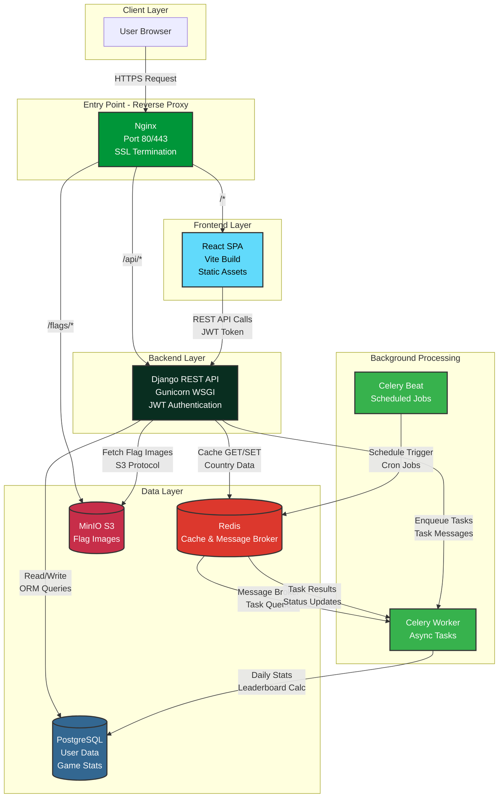

# Flag Wars


A full-stack multiplayer flag trivia game where players compete to identify country flags in real-time. Built with Django REST Framework, React, and deployed with Docker on a VPS with production-grade infrastructure.

## Live Demo

**Production URL:** [https://flagwars.mecebeci.com](https://flagwars.mecebeci.com)

## Project Overview

Flag Wars is a competitive trivia application that tests users' knowledge of world flags. Players answer questions, track their progress on global leaderboards, and compete for the best scores. The application features JWT authentication, real-time statistics calculation, and optimized image delivery through object storage.

### Key Features

- JWT-based user authentication with token refresh
- Real-time game sessions with score tracking
- Global leaderboard system with daily snapshots
- Redis caching for optimized performance
- S3-compatible object storage for flag images
- Background task processing with Celery
- Scheduled jobs for statistics calculation
- Production-ready Docker deployment
- SSL/TLS encryption with Let's Encrypt

## Tech Stack

### Frontend
- **React 19** - UI library
- **React Router v7** - Client-side routing
- **Axios** - HTTP client with JWT interceptors
- **Tailwind CSS v4** - Utility-first styling
- **Vite** - Build tool and dev server
- **JWT Decode** - Token parsing

### Backend
- **Django 5.1** - Web framework
- **Django REST Framework 3.16** - API development
- **SimpleJWT** - JWT authentication
- **drf-spectacular** - OpenAPI/Swagger documentation
- **Gunicorn** - WSGI HTTP server
- **Celery 5.6** - Distributed task queue
- **Celery Beat** - Periodic task scheduler

### Infrastructure
- **PostgreSQL 15** - Primary database
- **Redis 7** - Cache and message broker
- **MinIO** - S3-compatible object storage
- **Nginx** - Reverse proxy and SSL termination
- **Docker & Docker Compose** - Containerization
- **Let's Encrypt** - SSL certificates

### DevOps
- **GitHub Actions** - CI/CD pipeline
- **VPS Deployment** - Self-hosted production environment
- **Multi-stage Docker builds** - Optimized images

## Architecture



### Request Flow

1. **Client Request** - User browsers send HTTPS requests to the Nginx reverse proxy
2. **Route Distribution** - Nginx routes requests based on path:
   - `/` → React SPA (static files)
   - `/api/*` → Django REST API
   - `/flags/*` → MinIO object storage
3. **API Processing** - Django authenticates requests via JWT, queries PostgreSQL, and checks Redis cache
4. **Background Jobs** - Heavy operations are offloaded to Celery workers
5. **Scheduled Tasks** - Celery Beat triggers daily statistics and leaderboard calculations

## Getting Started

### Prerequisites

- Docker 20.10+
- Docker Compose 2.0+
- Git

### Local Development Setup

1. Clone the repository:
```bash
git clone https://github.com/yourusername/flagwars.git
cd flagwars
```

2. Create environment file:
```bash
cp .env.example .env
```

3. Edit `.env` with your configuration (see `.env.example` for all options)

4. Start all services:
```bash
docker-compose up --build
```

5. Run database migrations:
```bash
docker-compose exec web python manage.py migrate
```

6. Create a superuser:
```bash
docker-compose exec web python manage.py createsuperuser
```

7. Load initial country data:
```bash
docker-compose exec web python manage.py loaddata initial_data/countries.json
```

8. Access the application:
- Frontend: http://localhost:5173
- API: http://localhost:8000/api
- Admin Panel: http://localhost:8000/admin
- API Documentation: http://localhost:8000/api/schema/swagger-ui
- MinIO Console: http://localhost:9001
- Flower (Celery Monitor): http://localhost:5555

### Production Deployment

See [DEPLOYMENT.md](DEPLOYMENT.md) for detailed production deployment instructions.

## Project Structure

```
flagwars/
├── backend/                    # Django backend
│   ├── apis/                   # Main API app
│   │   ├── models.py           # Database models
│   │   ├── serializers.py      # DRF serializers
│   │   ├── views.py            # API endpoints
│   │   ├── services.py         # Business logic
│   │   └── tasks.py            # Celery tasks
│   ├── users/                  # User authentication app
│   ├── django_project/         # Django settings
│   │   ├── settings.py         # Configuration
│   │   ├── celery.py           # Celery setup
│   │   └── urls.py             # URL routing
│   ├── Dockerfile              # Dev Docker image
│   ├── Dockerfile.prod         # Production Docker image
│   └── requirements.txt        # Python dependencies
├── frontend/                   # React frontend
│   ├── src/
│   │   ├── components/         # React components
│   │   ├── pages/              # Route pages
│   │   ├── services/           # API client
│   │   └── App.jsx             # Root component
│   ├── Dockerfile              # Dev Docker image
│   ├── Dockerfile.prod         # Production Docker image
│   └── package.json            # Node dependencies
├── nginx/                      # Nginx configuration
│   └── default.conf            # Reverse proxy config
├── docker-compose.yml          # Dev environment
├── docker-compose.prod.yml     # Production environment
├── .env.example                # Environment template
└── README.md                   # This file
```

## API Documentation

The API is fully documented using OpenAPI 3.0 (Swagger). Access the interactive documentation:

- **Swagger UI:** http://localhost:8000/api/schema/swagger-ui
- **ReDoc:** http://localhost:8000/api/schema/redoc
- **OpenAPI Schema:** http://localhost:8000/api/schema

For endpoint details, see [API_DOCS.md](API_DOCS.md).

## Environment Variables

Key environment variables (see `.env.example` for complete list):

```bash
# Django
SECRET_KEY=your-secret-key-here
DEBUG=False
ALLOWED_HOSTS=localhost,127.0.0.1,yourdomain.com

# Database
POSTGRES_DB=flagwars
POSTGRES_USER=flagwars_user
POSTGRES_PASSWORD=your-db-password

# Redis
REDIS_PASSWORD=your-redis-password

# MinIO
MINIO_ROOT_USER=your-minio-user
MINIO_ROOT_PASSWORD=your-minio-password

# Celery Flower
FLOWER_USER=admin
FLOWER_PASSWORD=your-flower-password
```

## Development

### Running Tests

```bash
# Backend tests
docker-compose exec web python manage.py test

# Frontend tests
docker-compose exec frontend npm test
```

### Accessing Services

```bash
# Django shell
docker-compose exec web python manage.py shell

# Database shell
docker-compose exec db psql -U flagwars_user -d flagwars

# Redis CLI
docker-compose exec redis redis-cli -a your-redis-password

# View Celery logs
docker-compose logs -f celery_worker
```

### Making Changes

1. Backend changes are auto-reloaded by Django dev server
2. Frontend changes are hot-reloaded by Vite HMR
3. For dependency changes, rebuild containers:
```bash
docker-compose up --build
```

## Performance Optimizations

- **Redis Caching:** Country data cached for 24 hours, reducing database queries by 90%
- **MinIO CDN:** Flag images served directly via Nginx proxy
- **Database Indexing:** Optimized queries on user stats and leaderboards
- **Static File Compression:** Gzip enabled on Nginx
- **Connection Pooling:** PostgreSQL connection pool for efficient DB access
- **Lazy Loading:** Frontend images loaded on-demand

## Security

- JWT token-based authentication with refresh mechanism
- HTTPS-only in production with automatic HTTP redirect
- CORS configured for trusted origins only
- SQL injection protection via Django ORM
- XSS protection with Content Security Policy
- Secrets managed via environment variables
- Regular dependency updates for CVE patches

## Acknowledgments

- Flag images from [flag-icons](https://flagicons.lipis.dev/)
- Country data from [pycountry](https://pypi.org/project/pycountry/)
- Inspired by various geography quiz games

## Contact

Created by [Mehmet Emre Cebeci](https://github.com/mecebeci)

Portfolio: https://flagwars.mecebeci.com/
